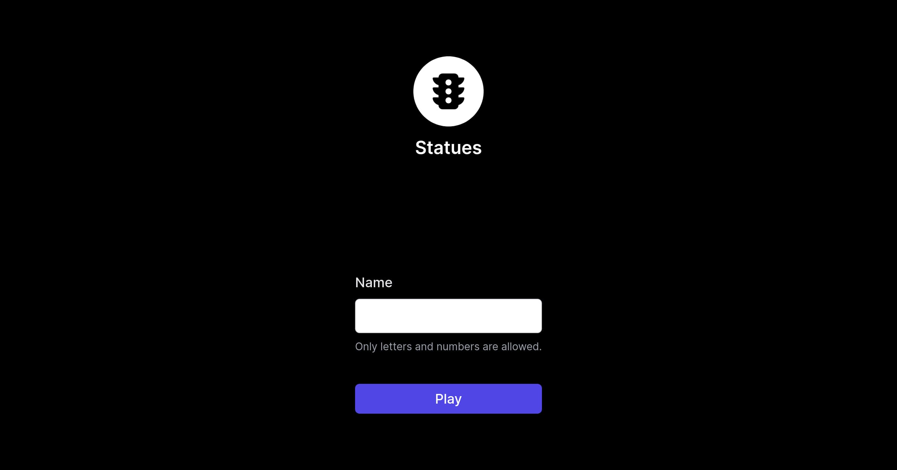

# BBVA Statues

<p align="center">

</p>

## Play

[https://statues.netlify.app](https://statues.netlify.app)

## Description

This is a challenge for [BBVA](https://www.bbva.es).

You can read all the details in the [challenge](https://permanent-link.com/to/alejandro-akbal/bbvaengineering-github-io-challenges-statues) page.

## Development

```bash
# Install dependencies with PNPM
npx pnpm i

# Serve with hot reload at localhost:3000
npx pnpm dev

# Build for production 
npx pnpm build
```
